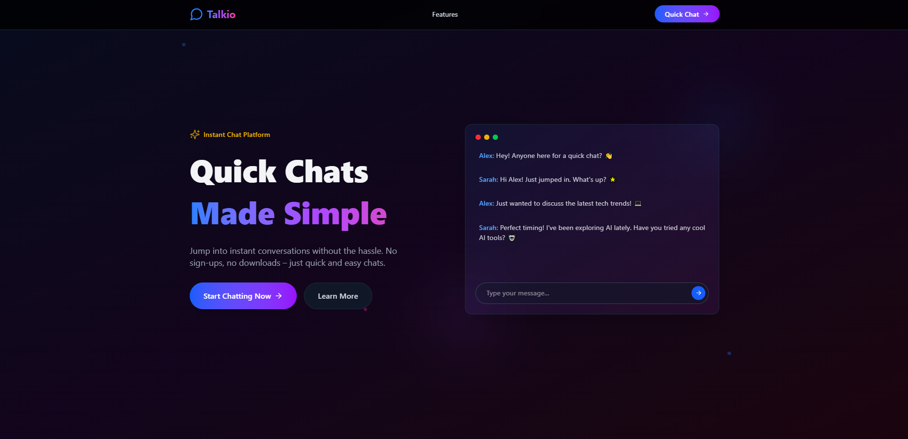

# Talkio - Real-time Room-Based Chat App

Talkio is a real-time chat application that allows users to create and join chat rooms using **Socket.io**. This project was built as a learning experience to understand WebSockets, room-based communication, and handling real-time events efficiently.

## 🚀 Features

- **Create & Join Rooms**: Users can create unique rooms or join existing ones using a room ID.
- **Real-time Messaging**: Messages are broadcasted in real time to all participants in a room.
- **Username Persistence**: Users enter a username, which is stored locally for session continuity.
- **Auto-scroll to Latest Messages**: The chatbox automatically scrolls to show new messages.
- **Handles Room Cleanup**: Empty rooms are automatically deleted when the last user leaves.

## 🛠️ Tech Stack

### **Frontend** (Client)
- React (with Vite)
- TypeScript
- Tailwind CSS
- React Router
- WebSockets (Socket.io-client)

### **Backend** (Server)
- Node.js
- Express.js
- Socket.io
- CORS Middleware

## 📂 Folder Structure

```
Talkio/
│── Backend/         # Express + Socket.io server
│   ├── server.ts    # Main server file
│── Frontend/          # React frontend
│   ├── src/
│   │   ├── components/  # Reusable UI components
│   │   ├── pages/       # App pages (ChatRoom, LandingPage, etc.)
│   │   ├── utils/       # Helper functions (socket.ts, etc.)
│   │   ├── App.tsx      # Root component
│── README.md        # Project documentation
│── package.json     # Dependencies and scripts
```

## 🏗️ Setup & Installation

### Prerequisites
Ensure you have the following installed:
- Node.js (v18+ recommended)
- npm or yarn

### 1️⃣ Clone the Repository
```sh
git clone https://github.com/BeastxD7/talkio.git
cd talkio
```

### 2️⃣ Install Dependencies
#### Backend
```sh
cd backend
npm install
```
#### Frontend
```sh
cd ../Frontend
npm install
```

### 3️⃣ Run the Development Servers
#### Start the Backend Server
```sh
cd backend
npm run dev
```
#### Start the Frontend Server
```sh
cd ../Frontend
npm run dev
```

## 🔗 API Routes
| Method | Endpoint  | Description |
|--------|----------|-------------|
| GET    | /  | Check server |

## 🔧 WebSocket Events
| Event Name       | Description |
|-----------------|-------------|
| message         | Sends and receives chat messages |
| create-room     | Creates a new chat room |
| join-room       | Joins an existing room |
| join-notify     | Notifies users when someone joins |

## 📸 Screenshots


## 📜 License
This project is open-source under the MIT License.

---
### 🌟 Learning Outcome
This project helped me practice **Socket.io**, **real-time event handling**, and **room-based communication**. 🚀

💡 Future improvements could include:
- Adding authentication (JWT or OAuth)
- Implementing message history with a database (PostgreSQL or MongoDB)
- Improving UI/UX with animations

---
Made with ❤️ by **Shashank** ✨

